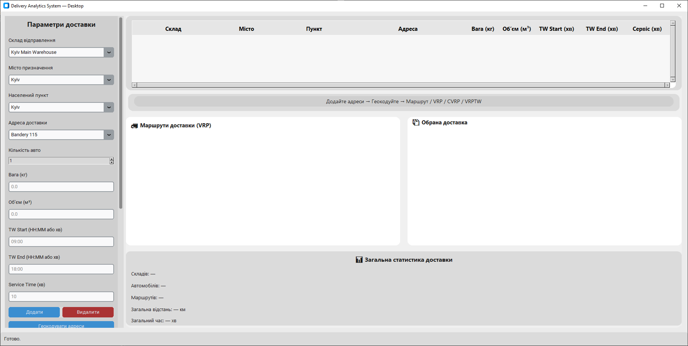
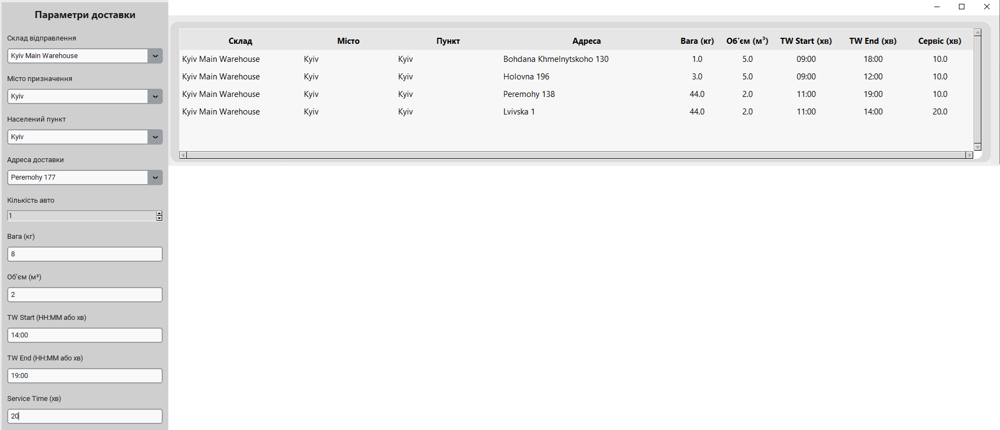
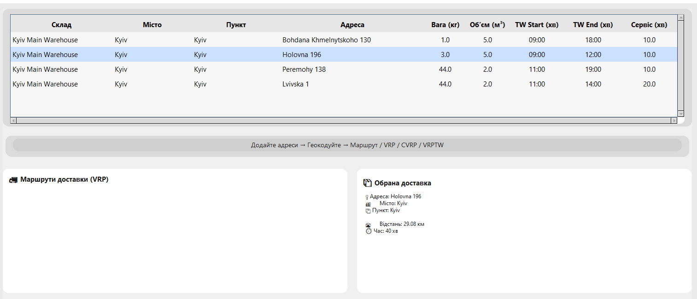
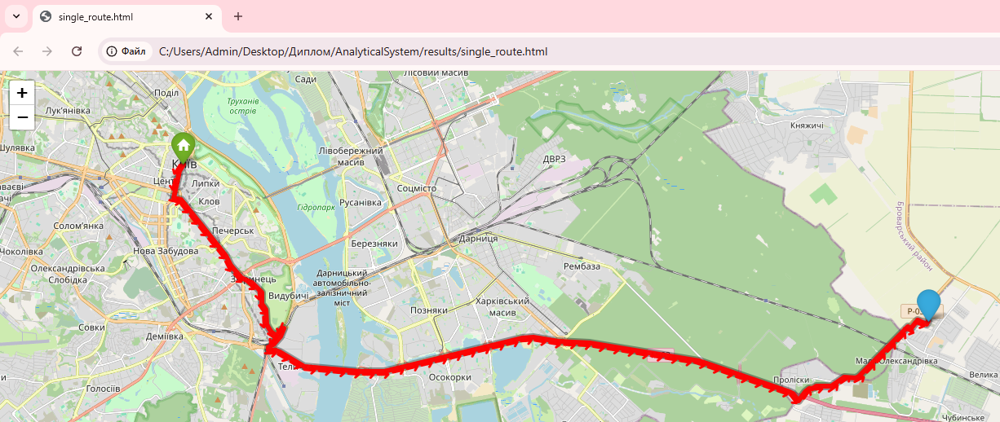
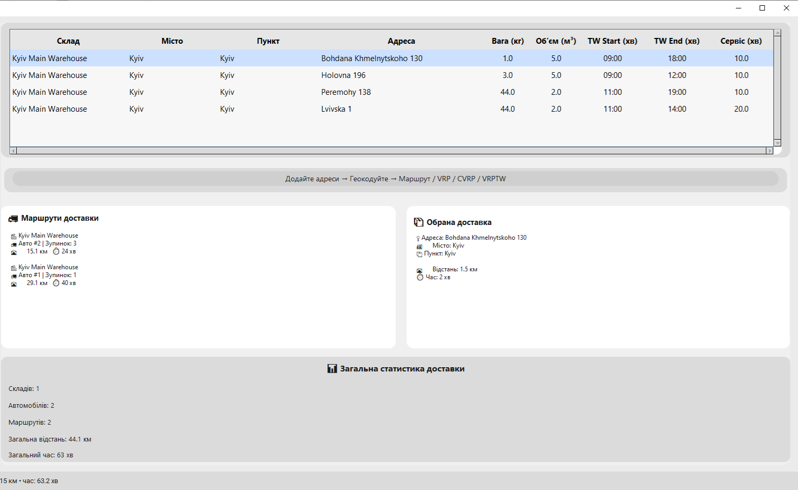
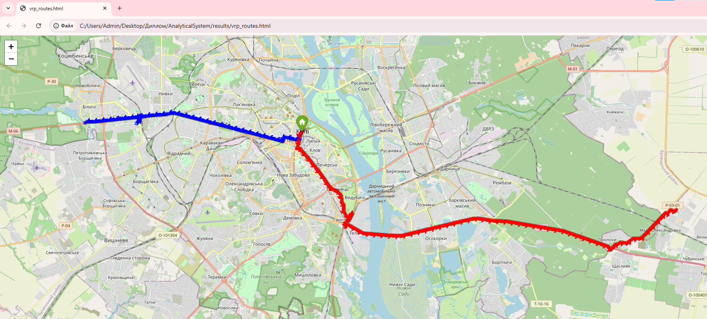
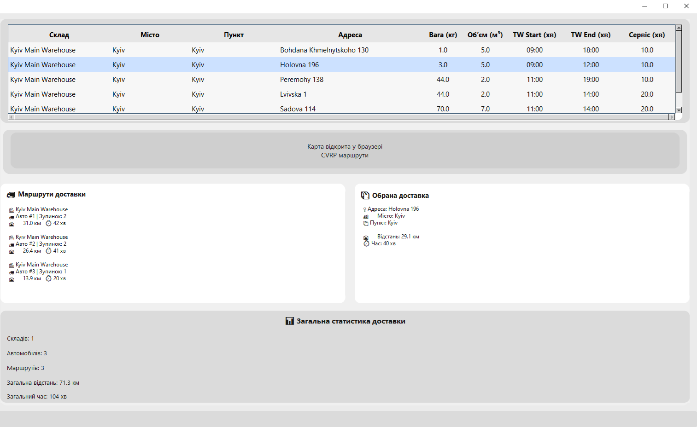
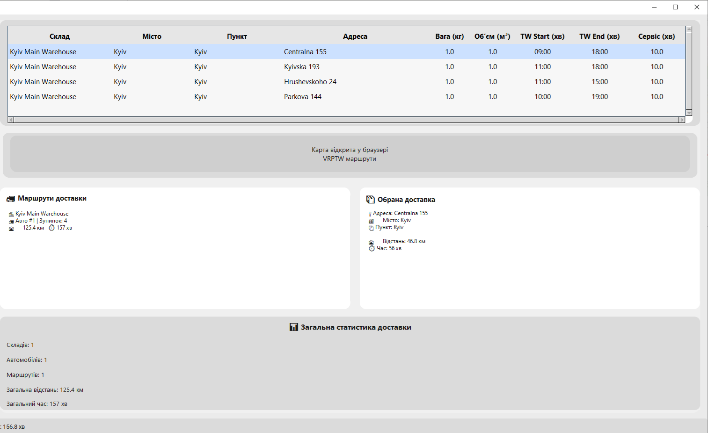
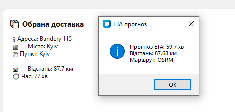

# Система оптимізації процесів доставки в електронній комерції

Інформаційно-аналітична система для оптимізації маршрутів доставки на основі моделей VRP, CVRP, VRPTW та прогнозування ETA.

## Про проект

**Кваліфікаційна робота** на здобуття ступеня магістра  
Спеціальність: 122 «Комп’ютерні науки»  
Освітньо-професійна програма: «Управління інформацією та аналітика даних»  
Національний університет харчових технологій (НУХТ), Київ, 2025

**Тема роботи:** Розроблення аналітичної моделі для оптимізації процесів доставки в електронній комерції

## Мета проекту

Розробити аналітичну модель та інформаційно-аналітичну систему оптимізації маршрутів доставки з урахуванням часових вікон, обмежень місткості транспортних засобів, географічних особливостей та динамічного прогнозування часу прибуття (ETA).

## Використані технології

- Python
- Google OR-Tools (VRP, CVRP, VRPTW)
- Random Forest Regressor (прогнозування ETA)
- OSRM + Nominatim (маршрутизація та геокодування)
- Folium (Leaflet) — візуалізація маршрутів на карті
- SQLite — база даних
- CustomTkinter — графічний інтерфейс

## Структура репозиторію

- `122_Krupka_Nazar_Serhiyovych_it2025.doc` — текст кваліфікаційної роботи
- `AnalyticalSystem.zip` — архів з повною програмою
- `screenshots/` — скріншоти інтерфейсу та результатів роботи системи
- `data/` — тестові набори даних (при наявності)

## Скріншоти системи

**Головне вікно системи**

**Введення даних доставки та параметрів**

**Результат оптимізації одиночного маршруту**

**Візуалізація оптимального маршруту на карті**

**Результати оптимізації VRP**

**Візуалізація кількох маршрутів VRP на карті**

**Результати оптимізації CVRP (з урахуванням місткості)**

**Результати оптимізації VRPTW (з часовими вікнами)**

**Прогнозування ETA на маршруті**

**Аналітичні графіки ефективності системи**

## Автор

**Крупка Назар Сергійович**  
Магістр спеціальності 122 «Комп’ютерні науки»  
Національний університет харчових технологій (НУХТ), 2025

---

Розроблено в рамках кваліфікаційної роботи магістра.  
Система поєднує математичні моделі маршрутизації, машинне навчання та геоаналітику для підвищення ефективності доставки в електронній комерції.
