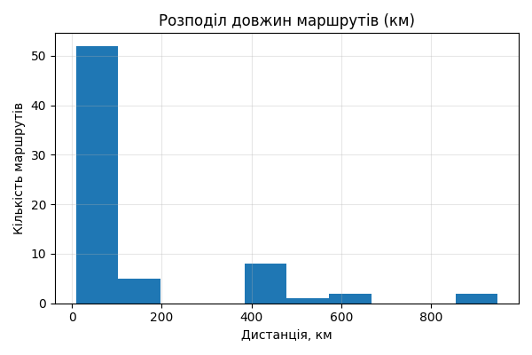
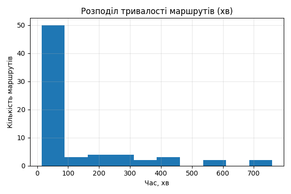
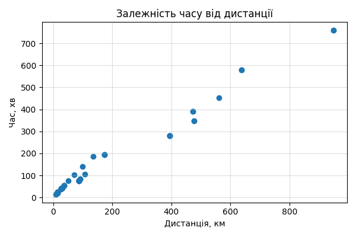
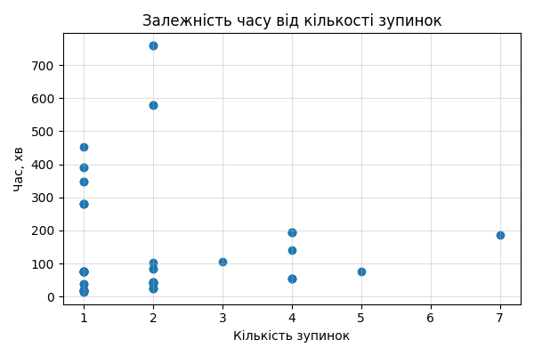
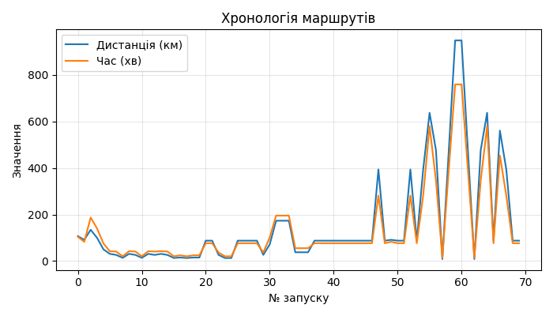
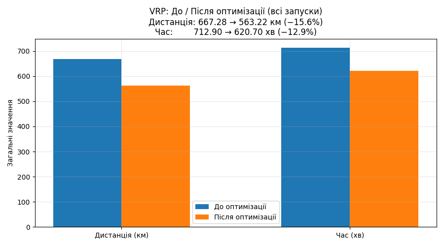
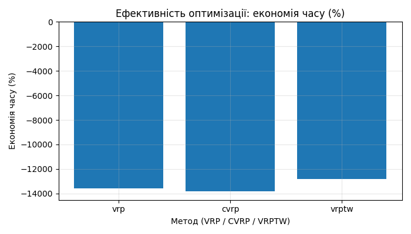
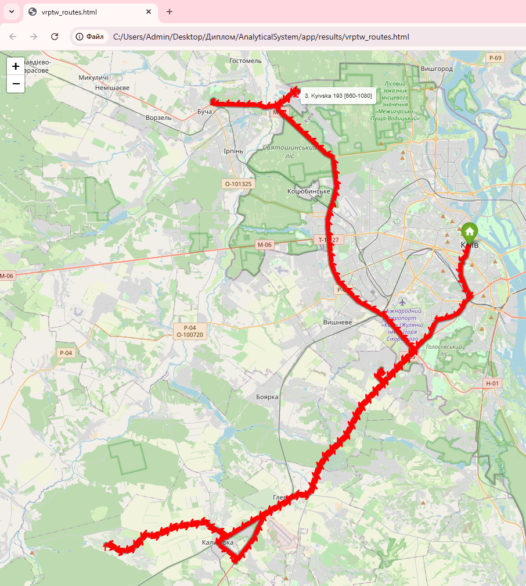

# Система оптимізації процесів доставки в електронній комерції

Інформаційно-аналітична система для оптимізації маршрутів доставки на основі математичних моделей VRP, CVRP, VRPTW та прогнозування ETA.

## Про проект

**Кваліфікаційна робота** на здобуття ступеня магістра  
Спеціальність: 122 «Комп’ютерні науки»  
Освітньо-професійна програма: «Управління інформацією та аналітика даних»  
Національний університет харчових технологій (НУХТ), Київ, 2025

**Тема роботи:** Розроблення аналітичної моделі для оптимізації процесів доставки в електронній комерції

## Використані технології

- Python, Google OR-Tools  
- Random Forest Regressor (прогнозування ETA)  
- OSRM + Nominatim  
- Folium (Leaflet.js)  
- SQLite, CustomTkinter  

## Структура репозиторію

- `122_Krupka_Nazar_Serhiyovych_it2025.doc` — текст кваліфікаційної роботи  
- `AnalyticalSystem.zip` — повний архів програми  
- `screenshots/` — скріншоти інтерфейсу та результатів апробації  

## Результати апробації системи

**Головне вікно програми**

**Форма введення даних доставки**

**Розподіл довжин маршрутів**

**Розподіл тривалості маршрутів**

**Залежність часу виконання від дистанції**

**Залежність часу виконання від кількості зупинок**

**Хронологія виконаних запусків**

**Порівняння показників до та після оптимізації VRP**

**Економія часу при використанні різних методів оптимізації**

**Візуалізація маршрутів на карті (приклади)**

## Автор

**Крупка Назар Сергійович**  
Магістр спеціальності 122 «Комп’ютерні науки»  
Національний університет харчових технологій (НУХТ), 2025

---

Кваліфікаційна робота присвячена розробленню аналітичної моделі та програмної системи оптимізації процесів доставки в електронній комерції з використанням сучасних методів маршрутизації, геоаналітики та машинного навчання.
